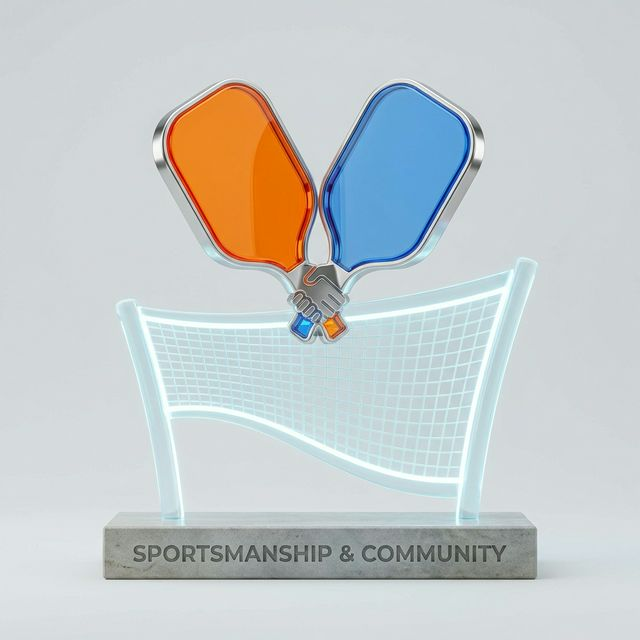

# 🤝 Văn hóa & Quy định Chung

## 1. Văn hóa Fair Play (Chơi đẹp)

- **Tôn trọng:** Luôn tôn trọng đối thủ, đồng đội và trọng tài.
- **Trung thực:** Tự giác báo điểm và xác nhận các tình huống bóng in/out một cách trung thực.
- **Ngôn từ:** Không sử dụng lời lẽ thô tục hoặc gây gổ trên sân.
- **Kết thúc:** Bắt tay hoặc chạm vợt sau mỗi trận đấu để thể hiện sự cảm ơn.

## 2. Văn hóa Pickleball
Pickleball là môn thể thao của sự cộng đồng và niềm vui. Hãy giúp đỡ các thành viên mới và chia sẻ niềm đam mê.

## 3. Quy định Trang phục & Giày dép
Để bảo vệ mặt sân chuyên dụng, chúng tôi có quy định nghiêm ngặt:
- **Giày:** Chỉ sử dụng giày thể thao chuyên dụng (đế bằng, không để lại vết).
- **Cấm:** Tuyệt đối không đi giày cao gót, giày đế da cứng, giày đinh hoặc các loại dép không phù hợp vào mặt sân.
- **Trang phục:** Mặc quần áo thể thao lịch sự, thấm hút mồ hôi tốt.

---
*Vì một môi trường tập luyện văn minh, cảm ơn quý khách đã hợp tác!*
