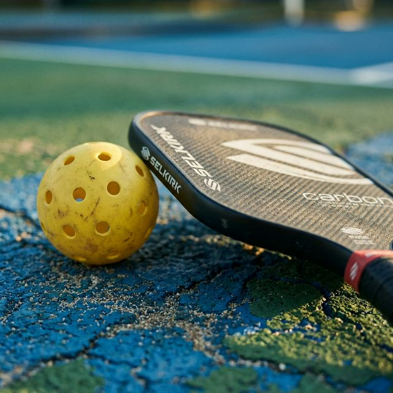

# 📞 Thông tin Sân & Dịch vụ

## ⏰ Giờ mở cửa
- **Thứ 2 - Chủ Nhật:** 05:00 - 23:00
- Phục vụ cả các ngày lễ, Tết (vui lòng đặt trước).

## 🎾 Các dịch vụ cung cấp
- **Thuê sân:** Theo giờ hoặc theo slot cố định hàng tháng.
- **CLB, Xé Vé, Social:** Bạn chưa có đủ đội, chúng tôi luôn có sẵn sân chơi cộng đồng để bạn tham gia. Hỗ trợ ghép đội. 
- **Zalo** Nhóm 1: https://zalo.me/g/mnqfms106
- **Zalo** Nhóm 2: https://zalo.me/g/sspxiq719
- **Alobo** https://datlich.alobo.vn/san/sport_bala_arena_pickleball
- **Hotline đặt sân: [0918.113.247]**
- **Đào tạo:** Các lớp học cơ bản cho người mới và nâng cao cho vận động viên.
- **Bán và Cho thuê thiết bị:** Vợt, bóng, máy tập bắn bóng.
- **Canteen:** Nước giải khát, đồ ăn nhẹ và khu vực nghỉ ngơi.

## 🚗 Hướng dẫn đường đi & Chỗ đỗ xe
### Hướng dẫn đường đi
- Sân nằm tại địa chỉ: **44 P. Ba La, Ba La, Hà Đông, Hà Nội**.
- Từ trung tâm, quý khách có thể đi dọc trục đường Quang Trung - Hà Đông hoặc sử dụng tàu điện trên cao (Dừng tại ga cuối).
- **Xem trên Google Maps:** [BaLa Pickleball - 44D Bala](https://maps.app.goo.gl/yibovhkskeKVgdoeA)

### Bản đồ định vị
<iframe src="https://www.google.com/maps/embed?pb=!1m18!1m12!1m3!1d3725.9472627914757!2d105.7545924758509!3d20.954619780674244!2m3!1f0!2f0!3f0!3m2!1i1024!2i768!4f13.1!3m3!1m2!1s0x31345300068a9f65%3A0xadff5a65f0f58e3e!2sBaLa%20Pickleball!5e0!3m2!1sen!2svn!4v1740458900445!5m2!1sen!2svn" width="100%" height="450" style="border:0;" allowfullscreen="" loading="lazy" referrerpolicy="no-referrer-when-downgrade"></iframe>

### Chỗ đỗ xe
- **Xe máy:** Khu vực đỗ xe miễn phí sát cửa sân.
- **Ô tô:** Bãi đỗ rộng rãi: 4 slot đỗ trong sân, 3 slot đỗ trước cổng, 5 slot đỗ bãi gara D&K.
- **Lưu ý:** Vui lòng khóa xe và không để đồ giá trị trong cốp xe.

---
**Hotline đặt sân: [0918.113.247]**
